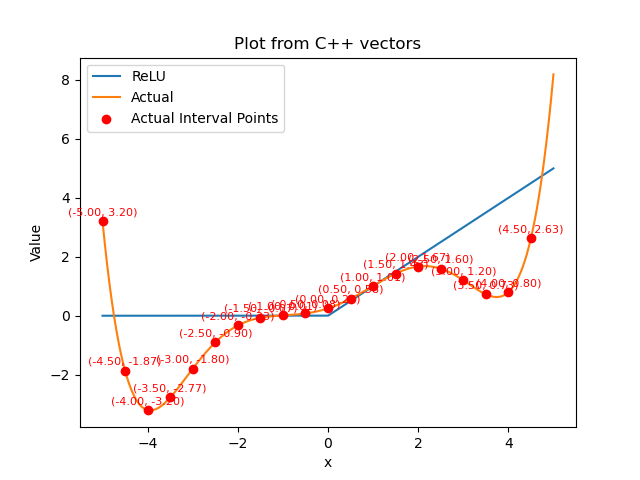
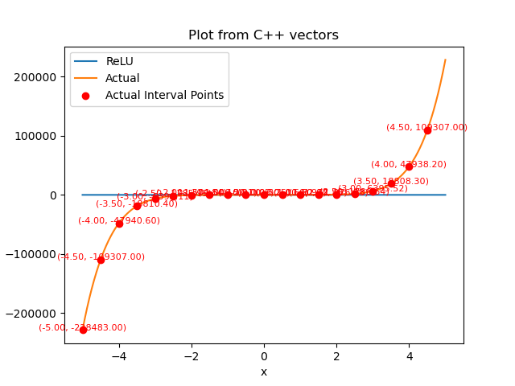
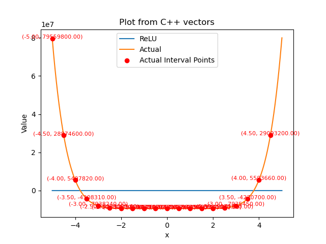
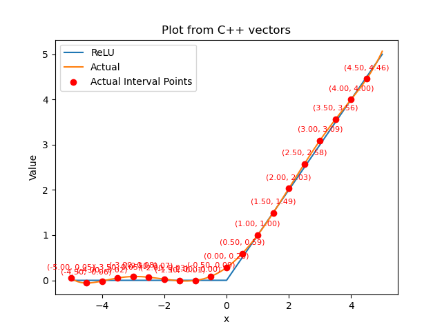
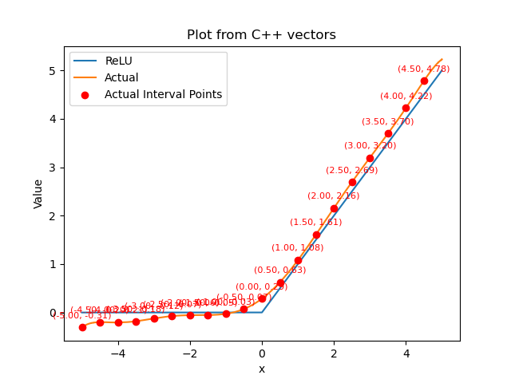
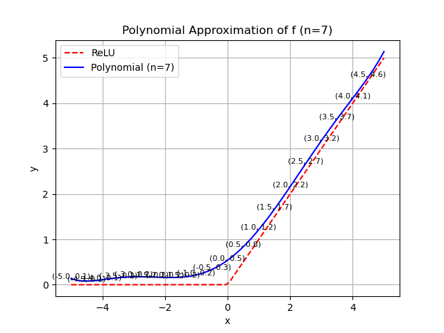
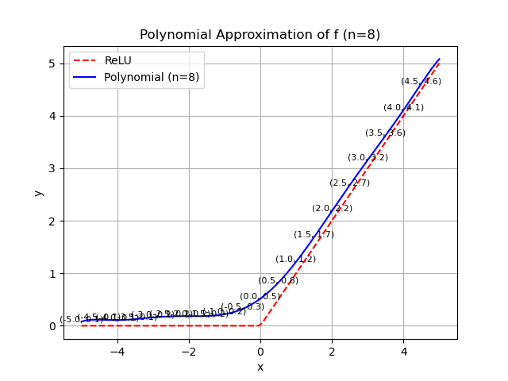

# 实验报告
* 本实验使用 `troy-nova` 为底层，实现了一个基于 CKKS 加密算法的 ReLU 运算程序，模拟了数据持有者将加密的数据 $x$ 送入装置，产生的输出解密后得到 $ReLU(x)$ 的过程。
* 本实验可以分为两部分：针对 ReLU 函数的多项式逼近，以及在密文域下的多项式运算。
## 多项式逼近
* 同态加密的原理是，对于明文 $a,b$ 与加密操作 $Enc$, 解密操作 $Dec$ 有 
$$Dec(Enc(a) + Enc(b)) = a + b$$ 
$$Dec(Enc(a) * Enc(b)) = a * b$$ 
* 但是，$ReLU(a)$ 的操作并不符合同态运算的规律, 因此我们需要用多项式来对 ReLU 进行近似。本实验当中，采取了 泰勒展开式，Remez 算法，最小二乘法对于多项式进行逼近的尝试，其中 Remez 算法的逼近效果最好，在某些最优情况下能够保证整体误差低于 $0.1$, 多数点的误差达到 $0.01$ 量级。
* 对于 Remez 算法的详细过程在这里不进行介绍，可以在以下链接当中找到相关的介绍资料：[1]，[2]。
* 在实验过程中，观察到使用 Remez 算法逼近 ReLU 函数的效果并不好，因此选择逼近其他的能够近似 ReLU 的函数。在本实验中，采用的是 GeLU 函数和 SquarePlus 函数的加权和：
$$f(x) = r * GeLU(x) + (1 - r) * SquarePlus(x)，r \in [0, 1]$$ 
* 其中，
$$GeLU(x) = x * \Phi(x), \Phi(x) = \int_{-\infty}^x \frac{1}{\sqrt{2 \pi }} \exp\left(-\frac{t^2}{2}\right) \, dt,$$
$$SquarePlus(x) = \frac {x + \sqrt{x^2 + b}} 2$$
* 这里的 $b, r$ 都是可调整的参数：见 `Polynomial_Calc/SiLU.h`。我们最后尝试用多项式逼近 $f(x)$, 实验结果如下：
### 实验1：针对不同多项式逼近算法的逼近效果
对于不同的多项式逼近算法，我们控制其次数相同，控制 $b = 1, r = 0.5$ 的情况下进行实验，分别计算 $6,7,8$ 次多项式：
* 泰勒展开式
  
* Remez：
  
* 最小二乘法：
  
从图中可以看到 泰勒展开式 的逼近效果最差，在同次数的情况下 Remez 算法和 最小二乘法 均有相对不错的逼近效果，而 Remez 算法的准确度更高一些。
### 实验2：使用 Remez 算法探究不同参数 $r$ 下的逼近效果
* 函数 $f$ 的设计源于我们在尝试逼近函数 ReLU 的时候发现 Remez 算法对于 ReLU 函数的逼近效果并不好，可能是由于其不光滑的特点导致的。因此，我们尝试构造一个较为光滑的，且和 ReLU 相近的函数 $f$，使用多项式逼近 $f$。考虑到 ReLU 函数的两种经典的逼近方式 GeLU 和 SquarePlus，前者小于 ReLU，后者大于 ReLU，因此自然的想到用二者的加权和进行对 ReLU 的逼近。
* 权重是一个重要的参数。为了调整精度，取 $10$ 次多项式，对于权重 $r$ 分别取 $0.1 - 0.5$ 之间的小数，结果如下：
    * $0.5$： 最大绝对差值: 0.27, 对应的 x 值: 0.00
    * $0.35$: 最大绝对差值: 0.18, 对应的 x 值: 0.00
    * $0.25$： 最大绝对差值: 0.13, 对应的 x 值: 0.00
    * $0.2$： 最大绝对差值: 0.10, 对应的 x 值: 0.00
    * $0.1875$: 最大绝对差值: 0.09, 对应的 x 值: 0.00
    * $0.175$: 最大绝对差值: 0.10, 对应的 x 值: -0.82
    * $0.15$: 最大绝对差值: 0.11, 对应的 x 值: -0.81
    * $0.1$: 最大绝对差值: 0.15, 对应的 x 值: -0.92
* 结果如图所示。可以看到当 $r$ 在 $0.175-0.2$ 的范围内，使用 $10$ 次多项式能够达到很好的近似效果。
## 密文域运算
* 确定了逼近所使用的多项式 $f$ 之后，如何快速的计算 $f(x)$ 也是一个重要的问题。使用尽可能少乘法运算能够在保证准确度的前提下使算法高效。
* 我们采用了秦九韶算法进行计算，其基本原理是，多项式 
$$\sum_{i = 0}^{n}a_ix^i = (...((a_nx + a_{n-1})x + a_{n-2})x + ... + a_1)x + a_0$$
* 在这种算法下，如果使用单线程运算，能够将运算的复杂度降低到 $O(n)$，而传统的将每一项分别算出再求和的算法则需要 $O(n^2)$。
* 我们尝试了多线程的运算，但由于总体耗时是毫秒数量级，与上下文切换的数量级接近，因此实际上测量结果是使用多线程运算的速率反而不如单线程。在使用多线程的时候只是使用了最基础的 `thread`, 和学长的交流当中，我了解到可能可以使用 memorypool，但是还没有实现。
* 在单线程的情况下，测量的时间如下：
    * 6次多项式：运行时间: 12.793 ms, 对 16384 个数进行计算，平均 0.78082275390625 us
    * 7次多项式：运行时间: 18.087 ms, 对 16384 个数进行计算，平均 1.10394287109375 us
    * 8次多项式：运行时间: 24.573 ms, 对 16384 个数进行计算，平均 1.49981689453125 us
    * 9次多项式：运行时间: 32.532 ms, 对 16384 个数进行计算，平均 1.9855957031249998 us
    * 10次多项式：行时间: 42.034 ms, 对 16384 个数进行计算，平均 2.5655517578125 us
* 而同样是单线程下，imp库的运行时间如下：
    ```
      Time per:     6.651 us (total     6.811 ms, 1024 times)
    ```
* 初步测量的结果显示，本项目的时间快于 imp 库，但是可能需要进一步更为规范的时间测试。
## 展望
* 以下的几个问题是我们还未能解决的：
    * 为什么直接逼近 ReLU 的效果不好？为什么偶数次多项式的逼近效果显著优于奇数次多项式？(数值分析相关)
    * memorypool的实现？学长的原话是效果可能没那么好，那么能否修改库本身达到更高的效率？

* 感谢刘轩奇学长在暑假当中与我频繁的讨论，指导我的实验思路；感谢刘卓涛老师为我入门隐私计算，对该领域的了解提供的帮助。


## 参考资料
* [1]: https://www.youtube.com/watch?v=j29rVHCpRUY
* [2]: http://staff.ustc.edu.cn/~tongwh/NA_2023/slides/book.pdf#section.9.6
